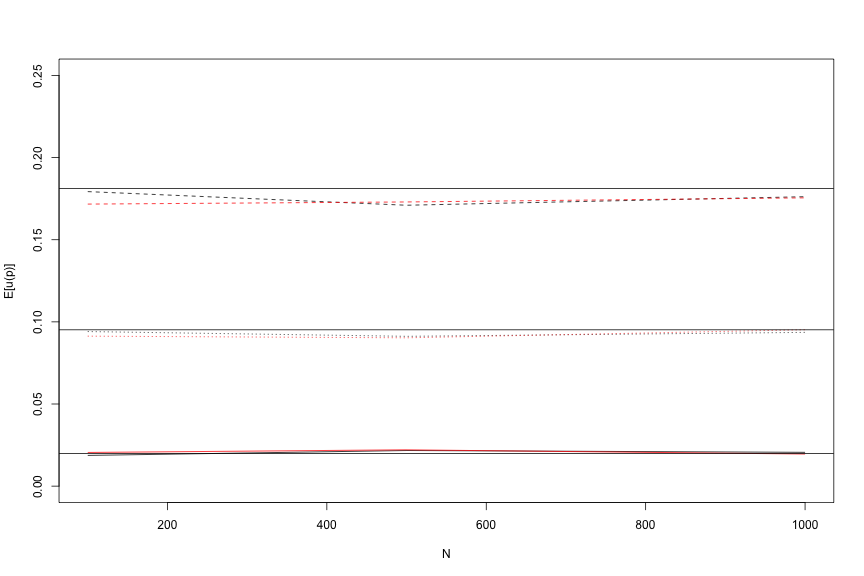

Fixation probabilities
====

For a one-locus, two-allele system with the following fitness model in a diploid population

|AA|Aa|aa
|----|:----:|:----:|
|1|1+s|1+2s|

the probabilty that a new mutant allele (a) fixes (goes from frequency 1/(2N) to 2N) is given by $$u(p)=\frac{1-e^{-2s}}{1-e^{-4Ns}}$$ and $$u(p) \approx 2s$$ when $s$ is small.

The above two formulas are well-known in evolutionary biology and are obtained under the continuous-time Wright-Fisher model, which is an approximation assuming $N \to \infty$ as $s \to 0$ such that $Ns \to C$, some constant.

Let's use this formulae to check the accuracy of fwdpp's sampler.  The example program is called "pfix", and we assume that it is compiled already and that you are processing this Rmd file in the fwdpp/examples directory.

It is simple to set up a matrix of estimates of the fixation probability. We will intentionally violated the assumptions of the above equations by letting $N$ get small and $s$ get large.

A simulation in R
======
The following R code is equivalent to what the pfix program is doing.   For the model described above, the fate of a mutation in a finite population is obtained by repeated binomial sampling with coefficients $q + \Delta q$ and $2N$.  For the additive/codominant/genic selection model described above, $\Delta q = \frac{pqs}{\bar{w}}$, where $\bar{w}$ is the population mean fitness.


Do the work
====

Let's build a matrix of parameters, output values from our two simulations, and the expected values from the diffusion results:

```
##          N    s  fwdpp      R      f1   f2
##  [1,]  100 0.01 0.0187 0.0205 0.02017 0.02
##  [2,]  500 0.01 0.0217 0.0221 0.01980 0.02
##  [3,] 1000 0.01 0.0205 0.0195 0.01980 0.02
##  [4,]  100 0.05 0.0941 0.0913 0.09516 0.10
##  [5,]  500 0.05 0.0912 0.0903 0.09516 0.10
##  [6,] 1000 0.05 0.0936 0.0952 0.09516 0.10
##  [7,]  100 0.10 0.1793 0.1717 0.18127 0.20
##  [8,]  500 0.10 0.1710 0.1730 0.18127 0.20
##  [9,] 1000 0.10 0.1762 0.1755 0.18127 0.20
```


OK, now plot (black is fwdpp, red is R, and horiz. lines are analytical values for N=1e3):

 


The two simulation methods are in very good agreement.  Remember that the error around each point is binomially-distributed, as the only two outcomes of the simulation are fixation or loss.

(Additionally, and perhaps embarassingly, the R implementation is faster than the C++ program, as the latter is doing a lot more each generation.  The library is not written with these trivial simulations in mind.)
