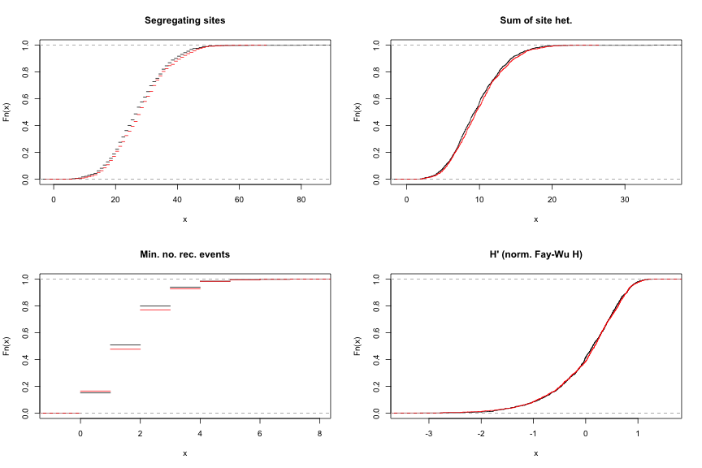
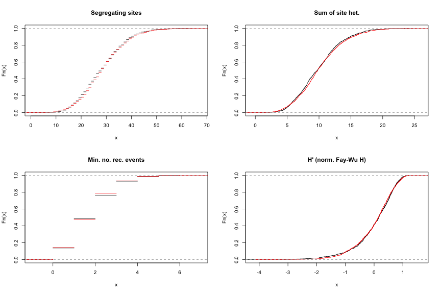
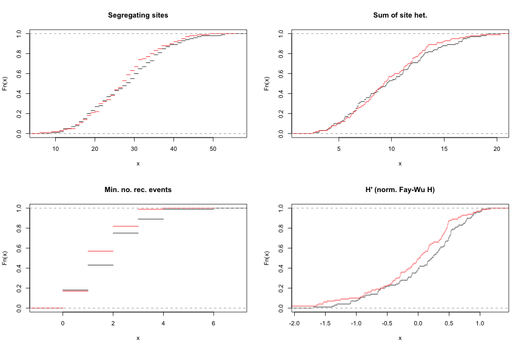

Neutral models
========================================================


N=100
====

```
## [1] "../examples/diploid_ind 100 10 10 1000 10  1000 157183348 |msstats"
```

 

```
##       stat      pv                    
##  [1,] "S"       "0.0776214640889803"  
##  [2,] "n1"      "0.0129345521127577"  
##  [3,] "next."   "0.000866669529359321"
##  [4,] "theta"   "0.0776214640889803"  
##  [5,] "pi"      "0.240603590494914"   
##  [6,] "thetaH"  "0.53605443439638"    
##  [7,] "Hprime"  "0.53605443439638"    
##  [8,] "tajd"    "0.432432065694456"   
##  [9,] "fulif"   "0.0971045235165382"  
## [10,] "fulid"   "0.181119645459484"   
## [11,] "fulifs"  "0.341001033991474"   
## [12,] "fulids"  "0.240603590494914"   
## [13,] "rm"      "0.647557292503006"   
## [14,] "rmmg"    "1"                   
## [15,] "nhaps"   "0.287719803332622"   
## [16,] "hdiv"    "0.0691903255858168"  
## [17,] "wallb"   "0.999543300305728"   
## [18,] "wallq"   "0.999999662009061"   
## [19,] "rosasrf" "0.120504073654557"   
## [20,] "rosasru" "0.263380632422274"   
## [21,] "zns"     "0.0776214640889803"
```


N=1000
====

```
## [1] "../examples/diploid_ind 1000 10 10 10000 10  1000 31316614 |msstats"
```

 

```
##       stat      pv                 
##  [1,] "S"       "0.465766847683193"
##  [2,] "n1"      "0.79439441957015" 
##  [3,] "next."   "0.827956861461567"
##  [4,] "theta"   "0.465766847683193"
##  [5,] "pi"      "0.240603590494914"
##  [6,] "thetaH"  "0.79439441957015" 
##  [7,] "Hprime"  "0.75909783849229" 
##  [8,] "tajd"    "0.827956861461567"
##  [9,] "fulif"   "0.685231404257084"
## [10,] "fulid"   "0.859294341747856"
## [11,] "fulifs"  "0.79439441957015" 
## [12,] "fulids"  "0.935580991934341"
## [13,] "rm"      "0.954058146874523"
## [14,] "rmmg"    "1"                
## [15,] "nhaps"   "0.913475513339838"
## [16,] "hdiv"    "0.999543300305728"
## [17,] "wallb"   "0.79439441957015" 
## [18,] "wallq"   "0.935580991934341"
## [19,] "rosasrf" "0.500359493413232"
## [20,] "rosasru" "0.432432065694456"
## [21,] "zns"     "0.827956861461567"
```


N=10000 (only do 100 sims, as this would take too long...)
====

```
## [1] "../examples/diploid_ind 10000 10 10 100000 10  100 31316614 |msstats"
```

 

```
##       stat      pv                  
##  [1,] "S"       "0.812748296417929" 
##  [2,] "n1"      "0.967068491755594" 
##  [3,] "next."   "0.467558592123606" 
##  [4,] "theta"   "0.812748296417929" 
##  [5,] "pi"      "0.967068491755594" 
##  [6,] "thetaH"  "0.699374199935276" 
##  [7,] "Hprime"  "0.0783230850480077"
##  [8,] "tajd"    "0.580617764921391" 
##  [9,] "fulif"   "0.699374199935276" 
## [10,] "fulid"   "0.906206389570314" 
## [11,] "fulifs"  "0.580617764921391" 
## [12,] "fulids"  "0.812748296417929" 
## [13,] "rm"      "0.280959953647258" 
## [14,] "rmmg"    "1"                 
## [15,] "nhaps"   "0.906206389570314" 
## [16,] "hdiv"    "0.906206389570314" 
## [17,] "wallb"   "0.580617764921391" 
## [18,] "wallq"   "0.580617764921391" 
## [19,] "rosasrf" "0.111133344907336" 
## [20,] "rosasru" "0.366726443884823" 
## [21,] "zns"     "0.0158141002853099"
```

