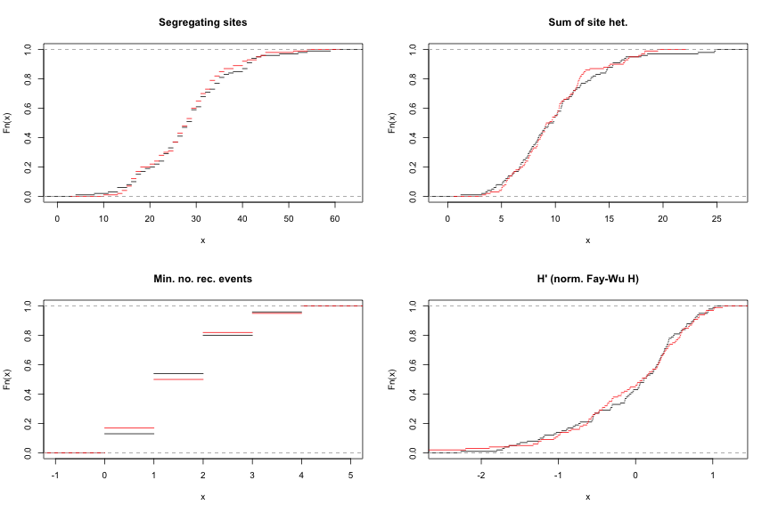

Neutral models
========================================================


N=100
====

```
## [1] "../examples/diploid 100 10 10 1000 10  100 296804052 |msstats"
```

 


N=1000
====

```
## [1] "../examples/diploid 100 10 10 1000 10  100 229342229 |msstats"
```

 

